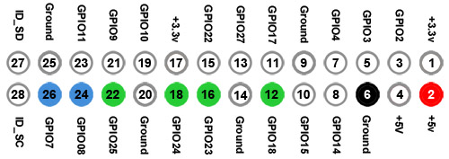
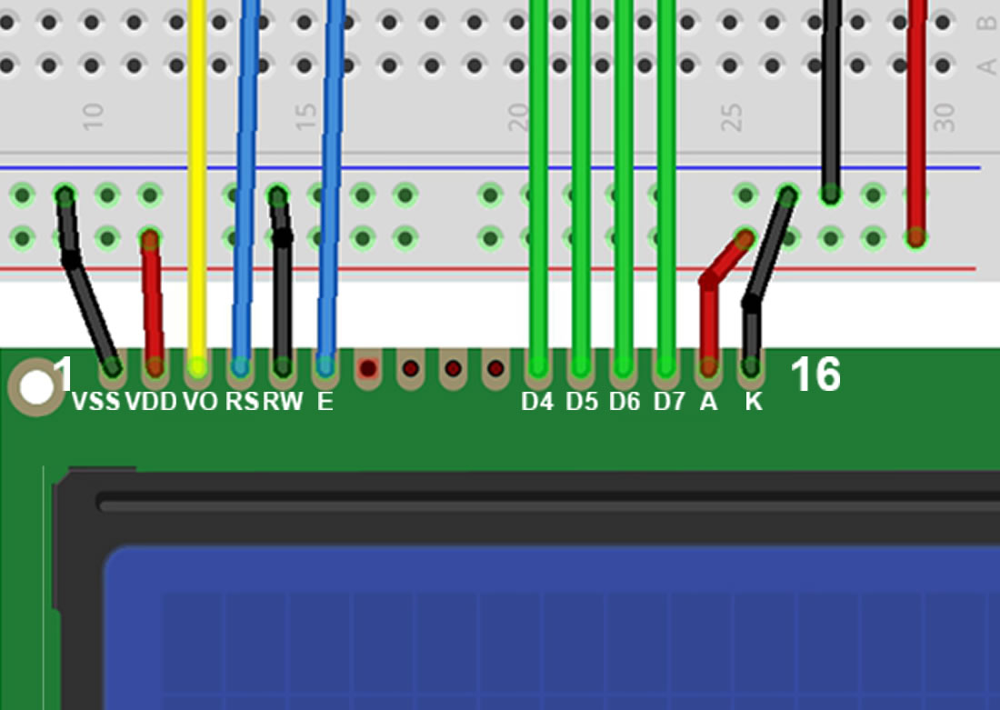

# lcd1602_gpio

Abstraction layer for interfacing beween raspberry pi and the lcd1602 - 16x2 lcd display module through GPIO

This is for controlling the lcd WITHOUT an additional I2C controller module

Uses a total of 8 pins: 1 - +5v output, 1 - ground and 6 - GPIO connections

Communication is done by sending 4 bits twice to represent a single 8 bit character, ASCII symbol or instruction/command- 

[crates.io](https://crates.io/crates/lcd1602_gpio)

## Table of contents

- [lcd1602\_gpio](#lcd1602_gpio)
  - [Table of contents](#table-of-contents)
  - [Please read the instructions !!!](#please-read-the-instructions-)
  - [Wiring](#wiring)
  - [Usage](#usage)
    - [Installation](#installation)
    - [Basic usage](#basic-usage)
    - [Advanced usage](#advanced-usage)
  - [Common issues (Q\&A)](#common-issues-qa)
    - [Why is my display showing wrong characters/symbols?](#why-is-my-display-showing-wrong-characterssymbols)
  - [Code](#code)
    - [Pins](#pins)
    - [4 Bit communication](#4-bit-communication)
    - [Binary \& Hexadecimal](#binary--hexadecimal)
    - [Bitwise operations](#bitwise-operations)
  - [References](#references)


## Please read the instructions !!!

Before attempting to connect you must make sure you understand what pins on the lcd module and the raspberry pi are used for, incorect wiring may cause damage to either your raspberry pi or/and the lcd module.

First of all make sure your lcd module has the same configuration as the lcd1602 module, any other modules may not be applicable for this guide.

All the credit on how to correctly connect the lcd to the pi goes to this guide - [mbtechworks.com](https://www.mbtechworks.com/projects/drive-an-lcd-16x2-display-with-raspberry-pi.html)

## Wiring

<table>
<tr>
    <th>LCD Pin</th>
    <th>LCD Function</th>
    <th>Connected to</th>
    <th>Pi Pin</th>
</tr>
<tr>
    <td>01</td>
    <td>VSS (GND)</td>
    <td>Breadboard GND</td>
    <td></td>
</tr>
<tr>
    <td>02</td>
    <td>VDD (+5v)</td>
    <td>Breadboard +5v</td>
    <td></td>
</tr>
<tr>
    <td>03</td>
    <td>VO (Contrast)</td>
    <td>Middle pin of the potentiometer</td>
    <td></td>
</tr>
<tr>
    <td>04</td>
    <td>RS</td>
    <td>GPIO7</td>
    <td>26</td>
</tr>
<tr>
    <td>05</td>
    <td>RW</td>
    <td>Breadboard GND</td>
    <td></td>
</tr>
<tr>
    <td>06</td>
    <td>E</td>
    <td>GPIO8</td>
    <td>24</td>
</tr>
<tr>
    <td>07</td>
    <td>D0</td>
    <td></td>
    <td></td>
</tr>
<tr>
    <td>08</td>
    <td>D1</td>
    <td></td>
    <td></td>
</tr>
<tr>
    <td>09</td>
    <td>D2</td>
    <td></td>
    <td></td>
</tr>
<tr>
    <td>10</td>
    <td>D3</td>
    <td></td>
    <td></td>
</tr>
<tr>
    <td>11</td>
    <td>D4</td>
    <td>GPIO25</td>
    <td>22</td>
</tr>
<tr>
    <td>12</td>
    <td>D5</td>
    <td>GPIO24</td>
    <td>18</td>
</tr>
<tr>
    <td>13</td>
    <td>D6</td>
    <td>GPIO23</td>
    <td>16</td>
</tr>
<tr>
    <td>14</td>
    <td>D7</td>
    <td>GPIO18</td>
    <td>12</td>
</tr>
<tr>
    <td>15</td>
    <td>A (+5V)</td>
    <td>Breadboard +5v</td>
    <td></td>
</tr>
<tr>
    <td>16</td>
    <td>K (GND)</td>
    <td>Breadboard GND</td>
    <td></td>
</tr>
</table>

<hr>





## Usage

### Installation

Add the crate to your project:

```shell
cargo add lcd1602_gpio
```

or add to Cargo.toml manually:

```toml
[dependencies]
lcd1602_gpio = "0.1.0"
```

check for the latest version on crates.io/lcd1602_gpio

### Basic usage

```rust
use std::error::Error;
use std::thread;
use std::time::Duration;

// Import the library
use lcd1602_gpio::{LCDController, LcdLine};

fn sleep(secs: u64) {
    let delay = Duration::new(secs, 0);
    thread::sleep(delay);
}

fn main() -> Result<(), Box<dyn Error>> {
    // Create an LCD controller instance
    // You can use the default pins specified in the README or specify your own pin configuration with LCDController::new()
    let mut controller = LCDController::default().unwrap();

    // Print LCD controller information
    println!("{controller}");

    for _ in 0..5 {
        // Display text on the LCD
        controller.display_text("Hello World!", LcdLine::Line1);
        sleep(3);

        controller.display_text("Hello Rustaceans", LcdLine::Line2);
        sleep(5);

        controller.clear_screen();
        sleep(1);
    }

    Ok(())
}

```

### Advanced usage

Using the LCDController in a sepperate thread

The basic usage example might not fit your requirements because it locks up the main thread, if for example you might want to record some sensor data and show it on the lcd display then the program will have to wait for the lcd to update before further processing. In this case you might want to use the LCDController in a sepperate thread.

```rust
use std::error::Error;
use std::sync::{mpsc, Arc, Mutex};
use std::thread;
use std::time::Duration;

use lcd1602_gpio::{LCDController, LcdLine};

enum LCDCommand {
    DisplayText(String, LcdLine),
    ClearScreen,
    Quit,
}

fn main() -> Result<(), Box<dyn Error>> {
    // Create an LCD controller instance and wrap it in a mutex
    let shared_controller = Arc::new(Mutex::new(LCDController::default()?));

    // Create a channel for communication between main thread and LCD thread
    let (lcd_tx, lcd_rx) = mpsc::channel();

    // Clone the Arc to send to the LCD thread
    let shared_controller_clone = shared_controller.clone();

    // Spawn a new thread for handling the LCD
    let lcd_thread = thread::spawn(move || {
        for command in lcd_rx {
            match command {
                LCDCommand::DisplayText(text, line) => {
                    let mut controller = shared_controller_clone.lock().unwrap();
                    controller.display_text(&text, line);
                }
                LCDCommand::ClearScreen => {
                    let mut controller = shared_controller_clone.lock().unwrap();
                    controller.clear_screen();
                }
                LCDCommand::Quit => {
                    // Cleanup and exit the thread
                    break;
                }
            }
        }
    });

    // Continue with the main thread logic here
    // ...

    // Example: Send commands to the LCD thread
    lcd_tx.send(LCDCommand::DisplayText(
        "Hello World!".to_string(),
        LcdLine::Line1,
    ))?;
    thread::sleep(Duration::new(3, 0));
    lcd_tx.send(LCDCommand::DisplayText(
        "Hello Rustaceans".to_string(),
        LcdLine::Line2,
    ))?;
    thread::sleep(Duration::new(5, 0));

    // Send a command to clear the screen
    lcd_tx.send(LCDCommand::ClearScreen)?;

    // Signal the LCD thread to quit
    lcd_tx.send(LCDCommand::Quit)?;

    // Wait for the LCD thread to finish before exiting
    lcd_thread.join().unwrap();

    Ok(())
}

```

## Common issues (Q&A)

### Why is my display showing wrong characters/symbols?

This might happen if you connected the data pins in the wrong order or if any of the data pins are shorted, making the shorted pins register both the bits as on while only one is actually turned on, check with a multimeter and resolder the pins if this is the case.

## Code

This section is not necessary for using the crate, but helps understand how the code behind it works.

These will be all the basics you need to understand the communication between the pi and the lcd screen works. By replicating the same principles you can write the same module in any language if it supports GPIO.

### Pins

Basically the data is sent through the data pins (D4, D5, D6, D7)

RS (Register Select) pin controlls the mode of the display:

- low - COMMAND mode (data is interpeted as commands)
- high - CHARACTER mode (data is interpeted as characters) and the

RW (Read/Write) pin select either the Read or Write mode of the display

- in this case we connect it to the ground pin because we will only be sending data and not reading anything.

E (Enable) pin sends a signal to write the data when it is ready

### 4 Bit communication

The default communication happens with 8 bits which needs all 8 data pins to be connected. In our scenario we are running the LCD display in 4 bit mode which is enabled by sending command (0x32) to the display. This way we reduce the number of required connections to the raspberry pi.

The communication happens by first setting the RS mode to either COMMAND or CHARACTER depending on what is being sent, then sending the character or command in 2 - 4 bit chunks and toggling the E pin after each chunk to signal that the data is ready to be proccesed.

### Binary & Hexadecimal

First of all we need to understand how binary translates to hexadecimal, this is integral to how the data is sent over the data pins, this will translate to "low" for 0 and "high" for 1 on the pins.

```
(binary, hexadecimal, decimal)
// for the first digit of the hexadecimal
0000 0001 = 0x01 = 1
0000 0010 = 0x02 = 2
0000 0011 = 0x03 = 3
0000 0100 = 0x04 = 5
...
0000 1000 = 0x08 = 9

// for the second digit of the hexadecimal
0001 0000 = 0x10 = 16
0010 0000 = 0x20 = 32
0011 0000 = 0x30 = 48
0100 0000 = 0x40 = 64
...
1000 0000 = 0x80 = 128

// both digits
0001 0001 = 0x11 = 17
0001 0010 = 0x12 = 18
0010 0001 = 0x21 = 33
0010 0010 = 0x22 = 34
...
1001 1001 = 0x99 = 153

```

you can see how the hexadecimal first digit represents the first 4 bits of the binary and the second digit the second 4 bits

the maximum of hexadecimal is 0x99 which is 153 in decimal which means you can represent 154 different values in 8bit hexadecimal (because of 0x00)

### Bitwise operations

How are characters converted to which pin signals need to be active?

Comparison of the characters is done with logical AND operator which returns 1 both of the single bit pairs are equal to 1

Take for example the character "C" which is 0x43 (hex) = 0100 0011 (binary):

```
"C" (0100 0011, 0x43)

// Low bits

0100 0011 = 0x43 &&
0000 0001 = 0x01
|||| ||||       == equal
0000 0001 = 0x01

0100 0011 = 0x43 &&
0000 0010 = 0x02
|||| ||||       == equal
0000 0010 = 0x02

0100 0011 = 0x43 &&
0000 0100 = 0x04
|||| ||||       != not equal
0000 0000 = 0x00

0100 0011 = 0x43 &&
0000 1000 = 0x08
|||| ||||       != not equal
0000 0000 = 0x00

// High bits

0100 0011 = 0x43 &&
0001 0000 = 0x10
|||| ||||       != not equal
0000 0000 = 0x00

...
```

If the result of the operation is equal the pin of the bit that is == 1 is flipped to on/high and represents the 4 bits (either high bits or low bits (0xHL) H-high, L-low)

## References

- guide i used to figure this out - [mbtechworks.com](https://www.mbtechworks.com/projects/drive-an-lcd-16x2-display-with-raspberry-pi.html)
- [Hitachi HD44780 LCD controller](https://en.wikipedia.org/wiki/Hitachi_HD44780_LCD_controller)
- [GPIO pinout](https://pinout.xyz/)
- [rppal](https://docs.golemparts.com/rppal/) - crate used to interface with the GPIO pins of the raspberry pi through rust
- [Hex to Binary converter](https://www.rapidtables.com/convert/number/hex-to-binary.html)
